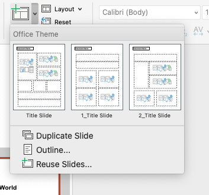

# classroom_reflection_template

This template was created for the PSU Bennett Family Center's Classroom Reflection handouts.

Feel free to use this resource in your classroom too!

# How it Works

1. Open the file `PSU_Bennett_Family_Center_Reflection_Template.pptx` with Microsoft Powerpoint
2. Click 'New Slide' and choose from the available templates.

   
3. Edit the `Classroom Name` in the top left corner.
4. Edit the `Daily Message` and `PA Learning Standards` that are applicable to the lessons of the day.
5. Add pictures by either dragging them into each `object` (see below):
   [https://www.loom.com/share/438145b772324c37a3f7b0a5a56c8132?sid=714af68e-fb1a-41f3-8c04-54a2c2086568](https://www.loom.com/share/438145b772324c37a3f7b0a5a56c8132?sid=714af68e-fb1a-41f3-8c04-54a2c2086568)
6. Export as PDF and Share!
